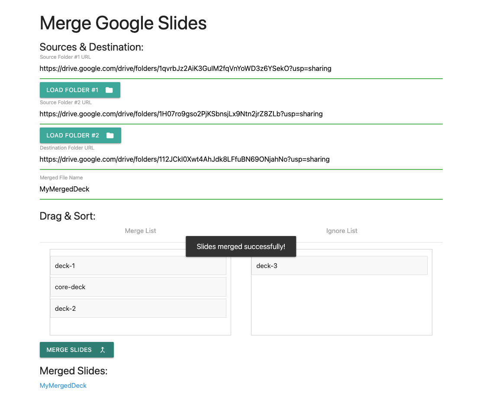

# google-slide-merge

### Overview:
Google Apps Script web app utility for merging Google slide decks into a new deck on Google Drive. Useful for building presentations from modularized content. Uses Google APIs for [Drive](https://developers.google.com/apps-script/advanced/drive) & [Slides](https://developers.google.com/apps-script/advanced/slides) as well as [sortable.js](https://github.com/SortableJS/Sortable?tab=readme-ov-file)

### Deploy:

* Create a new Google App Script

* In the code editor, open the Services menu and add the **Drive** and **Slides** services

* In the code editor, create a new file **index.html**

* Copy and paste the contents of **Code.gs** and **index.html**

* Deploy the web app
